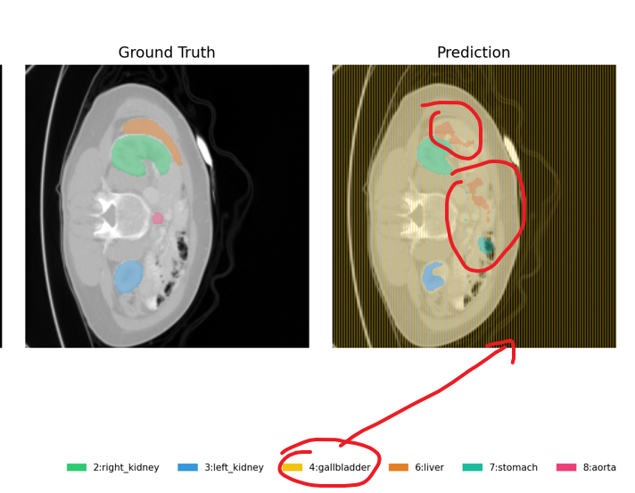
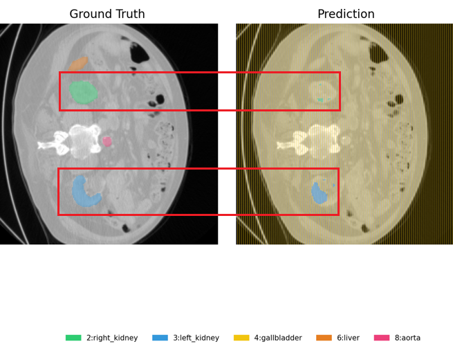
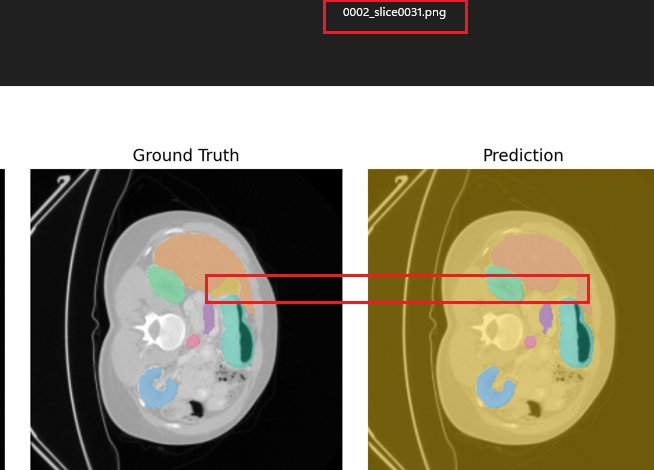
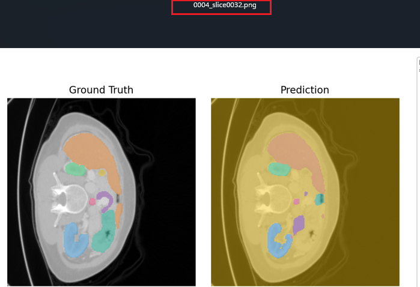
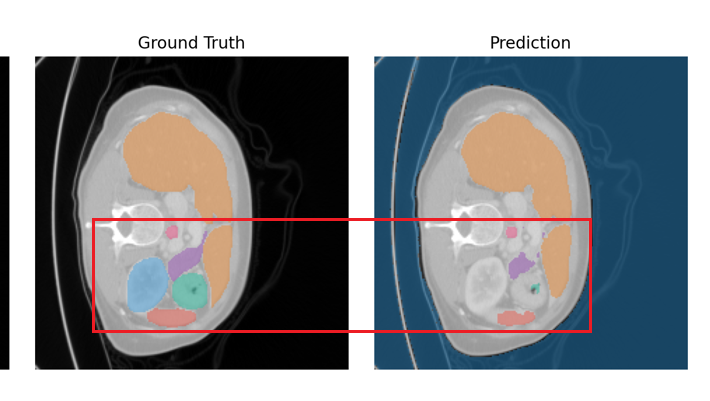
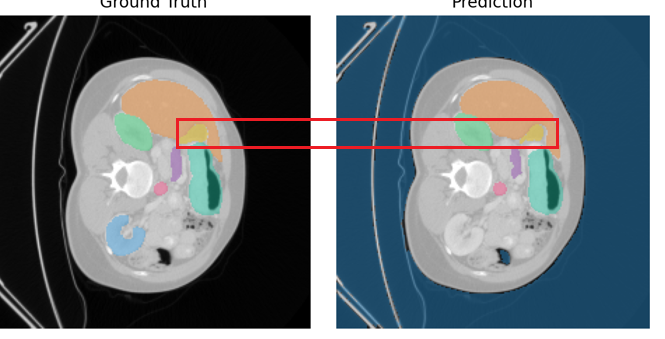
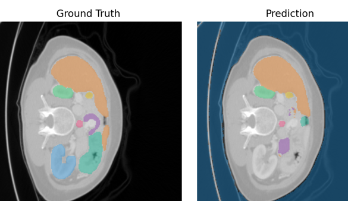
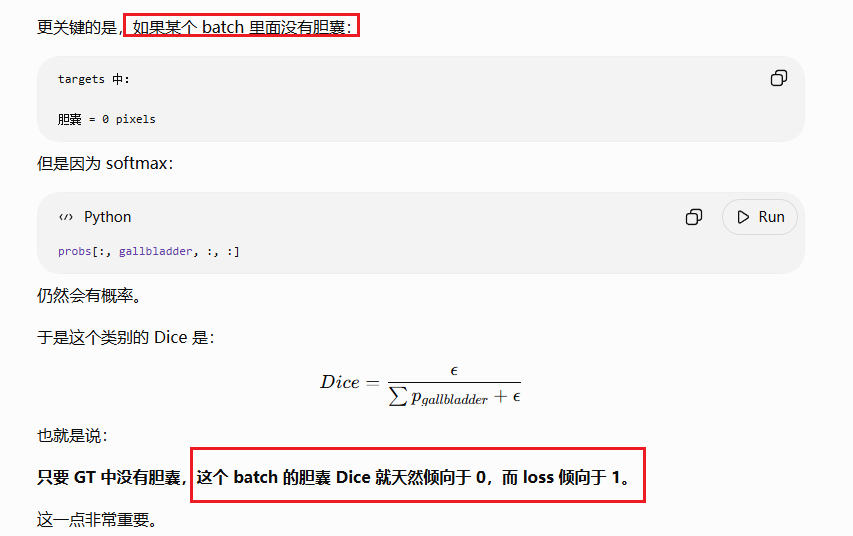
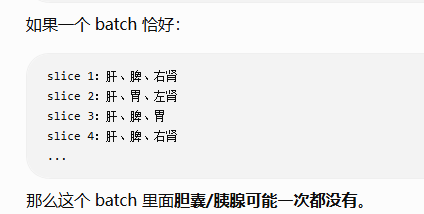
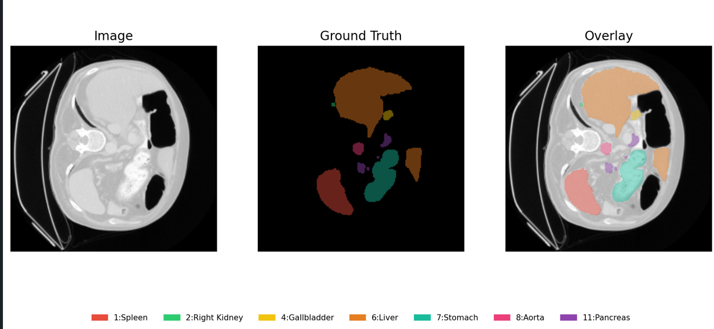

# 2026-09-24_003_PSC-UNet_V3

> date: 2026年9月24日 description: 8-organ only: 9-class head + eval8 label remap + weighted dice status: early_stopped best_val_dice: 0.4656 (epoch 176) completed_epochs: 226 / 300

### 1 训练收尾日志

最近若干 epoch 的训练/验证指标，来源 `history.csv`。

```bash
Epoch [220/300] train_loss=0.2376 train_dice=0.8287 val_loss=0.7394 val_dice=0.4342 time=14.8s
Epoch [220] class dice [val]: spleen=0.8273, right_kidney=0.4544, left_kidney=0.6831, gallbladder=0.0010, liver=0.8936, stomach=0.6189, aorta=0.5879, pancreas=0.1138
Epoch [220] class dice [train]: spleen=0.9662, right_kidney=0.9423, left_kidney=0.9439, gallbladder=0.0013, liver=0.9562, stomach=0.9594, aorta=0.9595, pancreas=0.9618
Epoch [221/300] train_loss=0.2314 train_dice=0.8192 val_loss=0.7255 val_dice=0.4508 time=14.9s
Epoch [222/300] train_loss=0.2328 train_dice=0.8372 val_loss=0.7303 val_dice=0.4437 time=13.9s
Epoch [223/300] train_loss=0.2232 train_dice=0.8348 val_loss=0.7329 val_dice=0.4479 time=14.3s
Epoch [224/300] train_loss=0.2289 train_dice=0.8336 val_loss=0.7346 val_dice=0.4310 time=14.5s
Epoch [225/300] train_loss=0.2263 train_dice=0.8408 val_loss=0.7250 val_dice=0.4371 time=15.1s
Epoch [226/300] train_loss=0.2092 train_dice=0.8420 val_loss=0.7332 val_dice=0.4378 time=14.2s
```

### 2 整体指标对比（train / val）

基于 best checkpoint 推理结果汇总；宏平均 Dice/IoU 等为 8 个目标器官均值（不含背景）。 百分比列单位为 %，数值保留四位小数。

| split | Dice (%) | IoU (%) | Precision (%) | Recall (%) | HD95    | FP ratio (%) | FN ratio (%) | 脾脏 Dice (%) | 脾脏 IoU (%) | 右肾 Dice (%) | 右肾 IoU (%) | 左肾 Dice (%) | 左肾 IoU (%) | 胆囊 Dice (%) | 胆囊 IoU (%) | 肝脏 Dice (%) | 肝脏 IoU (%) | 胃 Dice (%) | 胃 IoU (%) | 主动脉 Dice (%) | 主动脉 IoU (%) | 胰腺 Dice (%) | 胰腺 IoU (%) |
| ----- | -------- | ------- | ------------- | ---------- | ------- | ------------ | ------------ | ------------- | ------------ | ------------- | ------------ | ------------- | ------------ | ------------- | ------------ | ------------- | ------------ | ----------- | ---------- | --------------- | -------------- | ------------- | ------------ |
| train | 79.5992  | 76.0230 | 80.8856       | 79.7647    | 21.1260 | 5.8605       | 14.5816      | 89.4336       | 85.5024      | 89.0902       | 84.5977      | 88.4268       | 83.8784      | 0.1408        | 0.0709       | 88.3878       | 83.9017      | 91.7380     | 87.5494    | 95.8283         | 92.4230        | 93.7484       | 90.2607      |
| val   | 41.7083  | 34.5491 | 55.8367       | 38.3766    | 31.4438 | 6.0094       | 52.3839      | 66.0269       | 56.8074      | 48.6224       | 37.5580      | 46.1091       | 37.0836      | 0.1115        | 0.0560       | 68.5075       | 61.9157      | 42.6772     | 34.7610    | 50.2179         | 40.8838        | 11.3935       | 7.3276       |

### 3 训练集各器官详细指标

来源 `predictions/train/organ_metrics.csv`；按器官聚合的切片级均值，`*_percent` 列单位为 %。

| organ        | organ_cn | num_slices | dice_mean | dice_percent (%) | iou_mean | iou_percent (%) | precision_mean | precision_percent (%) | recall_mean | recall_percent (%) | fp_ratio_mean | fp_ratio_percent (%) | fn_ratio_mean | fn_ratio_percent (%) | hd95_mean | gt_area_mean | pred_area_mean | pred_gt_ratio_mean | gt_percent_mean | pred_percent_mean |
| ------------ | -------- | ---------- | --------- | ---------------- | -------- | --------------- | -------------- | --------------------- | ----------- | ------------------ | ------------- | -------------------- | ------------- | -------------------- | --------- | ------------ | -------------- | ------------------ | --------------- | ----------------- |
| spleen       | 脾脏     | 218        | 0.8943    | 89.4336          | 0.8550   | 85.5024         | 0.9163         | 91.6293               | 0.8763      | 87.6316            | 0.0004        | 0.0434               | 0.1196        | 11.9646              | 1.5942    | 1086.4128    | 1053.0505      | 0.9048             | 2.1652          | 2.0987            |
| right_kidney | 右肾     | 220        | 0.8909    | 89.0902          | 0.8460   | 84.5977         | 0.9007         | 90.0696               | 0.8868      | 88.6782            | 0.0004        | 0.0380               | 0.1132        | 11.3218              | 1.3884    | 454.6136     | 449.6864       | 0.9395             | 0.9060          | 0.8962            |
| left_kidney  | 左肾     | 224        | 0.8843    | 88.4268          | 0.8388   | 83.8784         | 0.8829         | 88.2945               | 0.8965      | 89.6526            | 0.0005        | 0.0498               | 0.0746        | 7.4554               | 1.3541    | 458.4643     | 466.9732       | 1.0015             | 0.9137          | 0.9307            |
| gallbladder  | 胆囊     | 535        | 0.0014    | 0.1408           | 0.0007   | 0.0709          | 0.0007         | 0.0714                | 0.0783      | 7.8266             | 0.4650        | 46.4972              | 0.5131        | 51.3114              | 153.7451  | 32.1981      | 23332.0112     | 289.8936           | 0.0642          | 46.5003           |
| liver        | 肝脏     | 377        | 0.8839    | 88.3878          | 0.8390   | 83.9017         | 0.9171         | 91.7075               | 0.8619      | 86.1945            | 0.0016        | 0.1624               | 0.1311        | 13.1141              | 4.8666    | 2861.0292    | 2776.9469      | 0.8957             | 5.7020          | 5.5344            |
| stomach      | 胃       | 243        | 0.9174    | 91.7380          | 0.8755   | 87.5494         | 0.9315         | 93.1503               | 0.9067      | 90.6745            | 0.0007        | 0.0719               | 0.0933        | 9.3255               | 2.3714    | 1205.1481    | 1181.9218      | 0.9422             | 2.4018          | 2.3556            |
| aorta        | 主动脉   | 499        | 0.9583    | 95.8283          | 0.9242   | 92.4230         | 0.9748         | 97.4758               | 0.9439      | 94.3932            | 0.0000        | 0.0047               | 0.0523        | 5.2269               | 1.3135    | 123.7074     | 120.0160       | 0.9695             | 0.2465          | 0.2392            |
| pancreas     | 胰腺     | 183        | 0.9375    | 93.7484          | 0.9026   | 90.2607         | 0.9469         | 94.6863               | 0.9307      | 93.0666            | 0.0002        | 0.0162               | 0.0693        | 6.9334               | 2.3744    | 289.4973     | 284.3279       | 0.9623             | 0.5770          | 0.5667            |

### 4 验证集各器官详细指标

来源 `predictions/val/organ_metrics.csv`；按器官聚合的切片级均值，`*_percent` 列单位为 %。

| organ        | organ_cn | num_slices | dice_mean | dice_percent (%) | iou_mean | iou_percent (%) | precision_mean | precision_percent (%) | recall_mean | recall_percent (%) | fp_ratio_mean | fp_ratio_percent (%) | fn_ratio_mean | fn_ratio_percent (%) | hd95_mean | gt_area_mean | pred_area_mean | pred_gt_ratio_mean | gt_percent_mean | pred_percent_mean |
| ------------ | -------- | ---------- | --------- | ---------------- | -------- | --------------- | -------------- | --------------------- | ----------- | ------------------ | ------------- | -------------------- | ------------- | -------------------- | --------- | ------------ | -------------- | ------------------ | --------------- | ----------------- |
| spleen       | 脾脏     | 43         | 0.6603    | 66.0269          | 0.5681   | 56.8074         | 0.7619         | 76.1940               | 0.6043      | 60.4286            | 0.0008        | 0.0841               | 0.3504        | 35.0392              | 7.1173    | 840.6512     | 636.8372       | 0.7057             | 1.6754          | 1.2692            |
| right_kidney | 右肾     | 49         | 0.4862    | 48.6224          | 0.3756   | 37.5580         | 0.7874         | 78.7363               | 0.4098      | 40.9777            | 0.0003        | 0.0313               | 0.5538        | 55.3798              | 11.7835   | 479.0408     | 218.7143       | 0.5200             | 0.9547          | 0.4359            |
| left_kidney  | 左肾     | 67         | 0.4611    | 46.1091          | 0.3708   | 37.0836         | 0.6497         | 64.9729               | 0.3936      | 39.3572            | 0.0006        | 0.0573               | 0.4618        | 46.1850              | 9.5035    | 356.2090     | 226.0896       | 0.6044             | 0.7099          | 0.4506            |
| gallbladder  | 胆囊     | 115        | 0.0011    | 0.1115           | 0.0006   | 0.0560          | 0.0006         | 0.0563                | 0.0914      | 9.1406             | 0.4733        | 47.3255              | 0.5430        | 54.2971              | 148.9265  | 28.6261      | 23745.8435     | 335.7227           | 0.0571          | 47.3251           |
| liver        | 肝脏     | 84         | 0.6851    | 68.5075          | 0.6192   | 61.9157         | 0.7497         | 74.9664               | 0.6575      | 65.7492            | 0.0034        | 0.3381               | 0.2827        | 28.2736              | 14.8450   | 2879.9405    | 2611.0714      | 0.8030             | 5.7397          | 5.2038            |
| stomach      | 胃       | 62         | 0.4268    | 42.6772          | 0.3476   | 34.7610         | 0.5402         | 54.0215               | 0.3883      | 38.8306            | 0.0019        | 0.1902               | 0.5542        | 55.4168              | 22.9823   | 708.6935     | 435.5000       | 0.6108             | 1.4124          | 0.8679            |
| aorta        | 主动脉   | 112        | 0.5022    | 50.2179          | 0.4088   | 40.8838         | 0.6913         | 69.1303               | 0.4417      | 44.1737            | 0.0002        | 0.0190               | 0.5419        | 54.1902              | 11.2349   | 138.9911     | 68.9464        | 0.5585             | 0.2770          | 0.1374            |
| pancreas     | 胰腺     | 43         | 0.1139    | 11.3935          | 0.0733   | 7.3276          | 0.2862         | 28.6160               | 0.0836      | 8.3554             | 0.0003        | 0.0298               | 0.9029        | 90.2897              | 25.1573   | 251.3023     | 39.9535        | 0.1766             | 0.5008          | 0.0796            |

### 5 各器官精简指标

仅保留 Dice、IoU、HD95 与参与统计的切片数，便于快速对比。

**训练集精简版**

| organ_cn | num_slices | Dice (%) | IoU (%) | HD95     |
| -------- | ---------- | -------- | ------- | -------- |
| 脾脏     | 218        | 89.4336  | 85.5024 | 1.5942   |
| 右肾     | 220        | 89.0902  | 84.5977 | 1.3884   |
| 左肾     | 224        | 88.4268  | 83.8784 | 1.3541   |
| 胆囊     | 535        | 0.1408   | 0.0709  | 153.7451 |
| 肝脏     | 377        | 88.3878  | 83.9017 | 4.8666   |
| 胃       | 243        | 91.7380  | 87.5494 | 2.3714   |
| 主动脉   | 499        | 95.8283  | 92.4230 | 1.3135   |
| 胰腺     | 183        | 93.7484  | 90.2607 | 2.3744   |

**验证集精简版**

| organ_cn | num_slices | Dice (%) | IoU (%) | HD95     |
| -------- | ---------- | -------- | ------- | -------- |
| 脾脏     | 43         | 66.0269  | 56.8074 | 7.1173   |
| 右肾     | 49         | 48.6224  | 37.5580 | 11.7835  |
| 左肾     | 67         | 46.1091  | 37.0836 | 9.5035   |
| 胆囊     | 115        | 0.1115   | 0.0560  | 148.9265 |
| 肝脏     | 84         | 68.5075  | 61.9157 | 14.8450  |
| 胃       | 62         | 42.6772  | 34.7610 | 22.9823  |
| 主动脉   | 112        | 50.2179  | 40.8838 | 11.2349  |
| 胰腺     | 43         | 11.3935  | 7.3276  | 25.1573  |

## 2 直接结论

验证集指标相比训练集大幅下滑，胆囊本身分割效果极差，胰腺在验证集上几乎失效，存在明显过拟合。

## **3 分析暴露问题**

1. 胆囊类别坍塌了, 导致至变成全图了
2. 分割不完整





# 2026-09-24_001_UNet_V1

> date: 2026年9月24日 description: 8-organ only: 9-class head + eval8 label remap + weighted dice status: early_stopped best_val_dice: 0.5873 (epoch 197) completed_epochs: 247 / 300

### 1 训练收尾日志

最近若干 epoch 的训练/验证指标，来源 `history.csv`。

```bash
Epoch [241/300] train_loss=0.2350 train_dice=0.8240 val_loss=0.6834 val_dice=0.4576 time=35.8s
Epoch [242/300] train_loss=0.2407 train_dice=0.8145 val_loss=0.6340 val_dice=0.5571 time=36.3s
Epoch [243/300] train_loss=0.2259 train_dice=0.8374 val_loss=0.6266 val_dice=0.5675 time=34.9s
Epoch [244/300] train_loss=0.2230 train_dice=0.8326 val_loss=0.6261 val_dice=0.5672 time=34.9s
Epoch [245/300] train_loss=0.2136 train_dice=0.8425 val_loss=0.6302 val_dice=0.5738 time=35.6s
Epoch [246/300] train_loss=0.2320 train_dice=0.8395 val_loss=0.6168 val_dice=0.5609 time=35.7s
Epoch [247/300] train_loss=0.2193 train_dice=0.8345 val_loss=0.6345 val_dice=0.5698 time=35.8s
```

### 2 整体指标对比（train / val）

基于 best checkpoint 推理结果汇总；宏平均 Dice/IoU 等为 8 个目标器官均值（不含背景）。 百分比列单位为 %，数值保留四位小数。

| split | Dice (%) | IoU (%) | Precision (%) | Recall (%) | HD95    | FP ratio (%) | FN ratio (%) | 脾脏 Dice (%) | 脾脏 IoU (%) | 右肾 Dice (%) | 右肾 IoU (%) | 左肾 Dice (%) | 左肾 IoU (%) | 胆囊 Dice (%) | 胆囊 IoU (%) | 肝脏 Dice (%) | 肝脏 IoU (%) | 胃 Dice (%) | 胃 IoU (%) | 主动脉 Dice (%) | 主动脉 IoU (%) | 胰腺 Dice (%) | 胰腺 IoU (%) |
| ----- | -------- | ------- | ------------- | ---------- | ------- | ------------ | ------------ | ------------- | ------------ | ------------- | ------------ | ------------- | ------------ | ------------- | ------------ | ------------- | ------------ | ----------- | ---------- | --------------- | -------------- | ------------- | ------------ |
| train | 80.4898  | 77.0624 | 81.0556       | 82.1837    | 23.3157 | 11.6682      | 7.5902       | 91.3667       | 87.6028      | 90.8456       | 86.6960      | 87.4964       | 82.5128      | 0.1377        | 0.0693       | 90.3445       | 86.3904      | 91.5369     | 87.2213    | 96.1073         | 92.7845        | 96.0832       | 93.2225      |
| val   | 58.5065  | 52.0258 | 68.4543       | 57.5709    | 30.9218 | 11.8289      | 28.9286      | 69.8998       | 63.0766      | 78.6679       | 71.5544      | 73.3531       | 66.5429      | 0.1198        | 0.0602       | 77.2713       | 71.9064      | 57.5143     | 49.1788    | 75.7654         | 66.7413        | 35.4609       | 27.1454      |

### 3 训练集各器官详细指标

来源 `predictions/train/organ_metrics.csv`；按器官聚合的切片级均值，`*_percent` 列单位为 %。

| organ        | organ_cn | num_slices | dice_mean | dice_percent (%) | iou_mean | iou_percent (%) | precision_mean | precision_percent (%) | recall_mean | recall_percent (%) | fp_ratio_mean | fp_ratio_percent (%) | fn_ratio_mean | fn_ratio_percent (%) | hd95_mean | gt_area_mean | pred_area_mean | pred_gt_ratio_mean | gt_percent_mean | pred_percent_mean |
| ------------ | -------- | ---------- | --------- | ---------------- | -------- | --------------- | -------------- | --------------------- | ----------- | ------------------ | ------------- | -------------------- | ------------- | -------------------- | --------- | ------------ | -------------- | ------------------ | --------------- | ----------------- |
| spleen       | 脾脏     | 217        | 0.9137    | 91.3667          | 0.8760   | 87.6028         | 0.9178         | 91.7782               | 0.9135      | 91.3542            | 0.0007        | 0.0700               | 0.0865        | 8.6458               | 1.6014    | 1091.4194    | 1090.4147      | 0.9617             | 2.1752          | 2.1732            |
| right_kidney | 右肾     | 220        | 0.9085    | 90.8456          | 0.8670   | 86.6960         | 0.9016         | 90.1621               | 0.9199      | 91.9868            | 0.0005        | 0.0482               | 0.0801        | 8.0132               | 1.3200    | 454.6136     | 464.1409       | 0.9854             | 0.9060          | 0.9250            |
| left_kidney  | 左肾     | 224        | 0.8750    | 87.4964          | 0.8251   | 82.5128         | 0.8782         | 87.8207               | 0.8785      | 87.8480            | 0.0005        | 0.0514               | 0.0932        | 9.3182               | 1.5559    | 458.4643     | 459.3036       | 0.9789             | 0.9137          | 0.9154            |
| gallbladder  | 胆囊     | 535        | 0.0014    | 0.1377           | 0.0007   | 0.0693          | 0.0007         | 0.0693                | 0.1508      | 15.0809            | 0.9289        | 92.8878              | 0.0618        | 6.1830               | 170.7995  | 32.1981      | 46609.6916     | 578.5181           | 0.0642          | 92.8924           |
| liver        | 肝脏     | 375        | 0.9034    | 90.3445          | 0.8639   | 86.3904         | 0.9240         | 92.4035               | 0.8923      | 89.2261            | 0.0019        | 0.1869               | 0.1054        | 10.5353              | 5.8474    | 2876.2880    | 2837.4800      | 0.9388             | 5.7324          | 5.6551            |
| stomach      | 胃       | 243        | 0.9154    | 91.5369          | 0.8722   | 87.2213         | 0.9311         | 93.1098               | 0.9043      | 90.4338            | 0.0008        | 0.0779               | 0.0957        | 9.5662               | 2.7813    | 1205.1481    | 1186.3951      | 0.9408             | 2.4018          | 2.3645            |
| aorta        | 主动脉   | 497        | 0.9611    | 96.1073          | 0.9278   | 92.7845         | 0.9664         | 96.6413               | 0.9572      | 95.7197            | 0.0001        | 0.0080               | 0.0428        | 4.2803               | 1.0869    | 124.2052     | 123.2113       | 0.9893             | 0.2475          | 0.2456            |
| pancreas     | 胰腺     | 183        | 0.9608    | 96.0832          | 0.9322   | 93.2225         | 0.9646         | 96.4595               | 0.9582      | 95.8204            | 0.0002        | 0.0151               | 0.0418        | 4.1796               | 1.5331    | 289.4973     | 288.3880       | 0.9876             | 0.5770          | 0.5748            |

### 4 验证集各器官详细指标

来源 `predictions/val/organ_metrics.csv`；按器官聚合的切片级均值，`*_percent` 列单位为 %。

| organ        | organ_cn | num_slices | dice_mean | dice_percent (%) | iou_mean | iou_percent (%) | precision_mean | precision_percent (%) | recall_mean | recall_percent (%) | fp_ratio_mean | fp_ratio_percent (%) | fn_ratio_mean | fn_ratio_percent (%) | hd95_mean | gt_area_mean | pred_area_mean | pred_gt_ratio_mean | gt_percent_mean | pred_percent_mean |
| ------------ | -------- | ---------- | --------- | ---------------- | -------- | --------------- | -------------- | --------------------- | ----------- | ------------------ | ------------- | -------------------- | ------------- | -------------------- | --------- | ------------ | -------------- | ------------------ | --------------- | ----------------- |
| spleen       | 脾脏     | 44         | 0.6990    | 69.8998          | 0.6308   | 63.0766         | 0.8108         | 81.0760               | 0.6583      | 65.8258            | 0.0007        | 0.0691               | 0.2759        | 27.5916              | 8.8335    | 821.5455     | 647.4773       | 0.7600             | 1.6373          | 1.2904            |
| right_kidney | 右肾     | 46         | 0.7867    | 78.6679          | 0.7155   | 71.5544         | 0.8181         | 81.8071               | 0.7775      | 77.7498            | 0.0007        | 0.0705               | 0.2052        | 20.5225              | 7.3746    | 510.2826     | 464.8913       | 0.8788             | 1.0170          | 0.9265            |
| left_kidney  | 左肾     | 55         | 0.7335    | 73.3531          | 0.6654   | 66.5429         | 0.7838         | 78.3788               | 0.7039      | 70.3888            | 0.0007        | 0.0656               | 0.2099        | 20.9922              | 7.5273    | 433.9273     | 397.8909       | 0.8480             | 0.8648          | 0.7930            |
| gallbladder  | 胆囊     | 115        | 0.0012    | 0.1198           | 0.0006   | 0.0602          | 0.0006         | 0.0602                | 0.1932      | 19.3240            | 0.9397        | 93.9715              | 0.0338        | 3.3801               | 167.9272  | 28.6261      | 47152.5826     | 661.7052           | 0.0571          | 93.9744           |
| liver        | 肝脏     | 81         | 0.7727    | 77.2713          | 0.7191   | 71.9064         | 0.8212         | 82.1157               | 0.7538      | 75.3807            | 0.0027        | 0.2679               | 0.2070        | 20.7034              | 14.5783   | 2986.6049    | 2832.6543      | 0.8516             | 5.9523          | 5.6454            |
| stomach      | 胃       | 60         | 0.5751    | 57.5143          | 0.4918   | 49.1788         | 0.7689         | 76.8923               | 0.5305      | 53.0514            | 0.0013        | 0.1258               | 0.4105        | 41.0540              | 19.9278   | 732.3167     | 519.2000       | 0.7078             | 1.4595          | 1.0348            |
| aorta        | 主动脉   | 108        | 0.7577    | 75.7654          | 0.6674   | 66.7413         | 0.8984         | 89.8415               | 0.6948      | 69.4799            | 0.0001        | 0.0074               | 0.3052        | 30.5201              | 4.6998    | 144.1389     | 97.7963        | 0.7292             | 0.2873          | 0.1949            |
| pancreas     | 胰腺     | 42         | 0.3546    | 35.4609          | 0.2715   | 27.1454         | 0.5746         | 57.4626               | 0.2937      | 29.3667            | 0.0005        | 0.0534               | 0.6666        | 66.6648              | 16.5058   | 257.2857     | 113.7143       | 0.4483             | 0.5128          | 0.2266            |

### 5 各器官精简指标

仅保留 Dice、IoU、HD95 与参与统计的切片数，便于快速对比。

**训练集精简版**

| organ_cn | num_slices | Dice (%) | IoU (%) | HD95     |
| -------- | ---------- | -------- | ------- | -------- |
| 脾脏     | 217        | 91.3667  | 87.6028 | 1.6014   |
| 右肾     | 220        | 90.8456  | 86.6960 | 1.3200   |
| 左肾     | 224        | 87.4964  | 82.5128 | 1.5559   |
| 胆囊     | 535        | 0.1377   | 0.0693  | 170.7995 |
| 肝脏     | 375        | 90.3445  | 86.3904 | 5.8474   |
| 胃       | 243        | 91.5369  | 87.2213 | 2.7813   |
| 主动脉   | 497        | 96.1073  | 92.7845 | 1.0869   |
| 胰腺     | 183        | 96.0832  | 93.2225 | 1.5331   |

**验证集精简版**

| organ_cn | num_slices | Dice (%) | IoU (%) | HD95     |
| -------- | ---------- | -------- | ------- | -------- |
| 脾脏     | 44         | 69.8998  | 63.0766 | 8.8335   |
| 右肾     | 46         | 78.6679  | 71.5544 | 7.3746   |
| 左肾     | 55         | 73.3531  | 66.5429 | 7.5273   |
| 胆囊     | 115        | 0.1198   | 0.0602  | 167.9272 |
| 肝脏     | 81         | 77.2713  | 71.9064 | 14.5783  |
| 胃       | 60         | 57.5143  | 49.1788 | 19.9278  |
| 主动脉   | 108        | 75.7654  | 66.7413 | 4.6998   |
| 胰腺     | 42         | 35.4609  | 27.1454 | 16.5058  |

## 评估

1. 依旧是出现了类别坍塌: 胆囊

   

2. 作为baseline, 结果比psc效果好

   


# 2026-09-24_001_UNet_V2

> date: 2026年9月24日
> description: change gb class weight from 2.5 to 5
> status: early_stopped
> best_val_dice: 0.5580 (epoch 210)
> completed_epochs: 260 / 300

### 1 训练收尾日志

最近若干 epoch 的训练/验证指标，来源 `history.csv`。

```bash
Epoch [254/300] train_loss=0.1869 train_dice=0.8259 val_loss=0.6296 val_dice=0.5436 time=37.3s
Epoch [255/300] train_loss=0.1622 train_dice=0.8340 val_loss=0.6242 val_dice=0.5233 time=36.9s
Epoch [256/300] train_loss=0.1749 train_dice=0.8251 val_loss=0.6179 val_dice=0.5425 time=37.1s
Epoch [257/300] train_loss=0.1940 train_dice=0.8199 val_loss=0.6274 val_dice=0.5440 time=37.6s
Epoch [258/300] train_loss=0.1871 train_dice=0.8256 val_loss=0.6386 val_dice=0.5254 time=37.3s
Epoch [259/300] train_loss=0.1963 train_dice=0.8309 val_loss=0.6151 val_dice=0.5492 time=38.0s
Epoch [260/300] train_loss=0.1816 train_dice=0.8165 val_loss=0.6848 val_dice=0.4041 time=37.6s
Epoch [260] class dice [val]: spleen=0.7073, right_kidney=0.3526, left_kidney=0.0000, gallbladder=0.4049, liver=0.7931, stomach=0.6324, aorta=0.7307, pancreas=0.4085
Epoch [260] class dice [train]: spleen=0.9503, right_kidney=0.4276, left_kidney=0.0000, gallbladder=0.9451, liver=0.9097, stomach=0.8982, aorta=0.9244, pancreas=0.9548
```

### 2 整体指标对比（train / val）

基于 best checkpoint 推理结果汇总；宏平均 Dice/IoU 等为 8 个目标器官均值（不含背景）。
百分比列单位为 %，数值保留四位小数。

| split | Dice (%) | IoU (%) | Precision (%) | Recall (%) | HD95 | FP ratio (%) | FN ratio (%) | 脾脏 Dice (%) | 脾脏 IoU (%) | 右肾 Dice (%) | 右肾 IoU (%) | 左肾 Dice (%) | 左肾 IoU (%) | 胆囊 Dice (%) | 胆囊 IoU (%) | 肝脏 Dice (%) | 肝脏 IoU (%) | 胃 Dice (%) | 胃 IoU (%) | 主动脉 Dice (%) | 主动脉 IoU (%) | 胰腺 Dice (%) | 胰腺 IoU (%) |
| --- | --- | --- | --- | --- | --- | --- | --- | --- | --- | --- | --- | --- | --- | --- | --- | --- | --- | --- | --- | --- | --- | --- | --- |
| train | 79.5586 | 76.1062 | 80.5868 | 78.9918 | 22.4195 | 6.9348 | 20.6426 | 90.0475 | 85.9486 | 87.5781 | 83.7454 | 0.0000 | 0.0000 | 90.3267 | 86.0076 | 86.4171 | 81.9380 | 90.3936 | 85.7885 | 96.2174 | 92.9393 | 95.4885 | 92.4826 |
| val | 51.2816 | 44.7247 | 63.4412 | 47.5646 | 30.4639 | 6.8653 | 49.5269 | 64.2413 | 56.6885 | 73.0134 | 65.0719 | 0.0000 | 0.0000 | 34.8661 | 27.7926 | 78.4632 | 72.4813 | 56.2246 | 48.6283 | 73.3912 | 64.1595 | 30.0528 | 22.9756 |

### 3 训练集各器官详细指标

来源 `predictions/train/organ_metrics.csv`；按器官聚合的切片级均值，`*_percent` 列单位为 %。

| organ | organ_cn | num_slices | dice_mean | dice_percent (%) | iou_mean | iou_percent (%) | precision_mean | precision_percent (%) | recall_mean | recall_percent (%) | fp_ratio_mean | fp_ratio_percent (%) | fn_ratio_mean | fn_ratio_percent (%) | hd95_mean | gt_area_mean | pred_area_mean | pred_gt_ratio_mean | gt_percent_mean | pred_percent_mean |
| --- | --- | --- | --- | --- | --- | --- | --- | --- | --- | --- | --- | --- | --- | --- | --- | --- | --- | --- | --- | --- |
| spleen | 脾脏 | 217 | 0.9005 | 90.0475 | 0.8595 | 85.9486 | 0.9247 | 92.4703 | 0.8816 | 88.1628 | 0.0004 | 0.0419 | 0.1184 | 11.8372 | 1.6401 | 1091.4194 | 1058.5714 | 0.9069 | 2.1752 | 2.1097 |
| right_kidney | 右肾 | 220 | 0.8758 | 87.5781 | 0.8375 | 83.7454 | 0.8826 | 88.2616 | 0.8742 | 87.4239 | 0.0004 | 0.0365 | 0.1258 | 12.5761 | 1.1579 | 454.6136 | 449.9773 | 0.9158 | 0.9060 | 0.8968 |
| left_kidney | 左肾 | 535 | 0.0000 | 0.0000 | 0.0000 | 0.0000 | 0.0000 | 0.0000 | 0.0000 | 0.0000 | 0.5504 | 55.0387 | 1.0000 | 100.0000 | 163.0942 | 191.9551 | 27519.3738 | 144.8595 | 0.3826 | 54.8457 |
| gallbladder | 胆囊 | 86 | 0.9033 | 90.3267 | 0.8601 | 86.0076 | 0.9083 | 90.8304 | 0.9013 | 90.1338 | 0.0002 | 0.0167 | 0.0987 | 9.8662 | 1.0728 | 200.3023 | 198.1279 | 0.9493 | 0.3992 | 0.3949 |
| liver | 肝脏 | 382 | 0.8642 | 86.4171 | 0.8194 | 81.9380 | 0.8964 | 89.6424 | 0.8475 | 84.7545 | 0.0022 | 0.2234 | 0.1343 | 13.4325 | 6.8352 | 2823.5812 | 2778.5314 | 0.8998 | 5.6274 | 5.5376 |
| stomach | 胃 | 246 | 0.9039 | 90.3936 | 0.8579 | 85.7885 | 0.9115 | 91.1513 | 0.9009 | 90.0904 | 0.0010 | 0.0988 | 0.0880 | 8.7974 | 2.8831 | 1190.4512 | 1185.1829 | 0.9641 | 2.3726 | 2.3621 |
| aorta | 主动脉 | 497 | 0.9622 | 96.2174 | 0.9294 | 92.9393 | 0.9626 | 96.2583 | 0.9629 | 96.2915 | 0.0001 | 0.0083 | 0.0371 | 3.7085 | 0.9418 | 124.2052 | 123.9799 | 0.9995 | 0.2475 | 0.2471 |
| pancreas | 胰腺 | 183 | 0.9549 | 95.4885 | 0.9248 | 92.4826 | 0.9608 | 96.0805 | 0.9508 | 95.0774 | 0.0001 | 0.0142 | 0.0492 | 4.9226 | 1.7306 | 289.4973 | 286.6011 | 0.9795 | 0.5770 | 0.5712 |

### 4 验证集各器官详细指标

来源 `predictions/val/organ_metrics.csv`；按器官聚合的切片级均值，`*_percent` 列单位为 %。

| organ | organ_cn | num_slices | dice_mean | dice_percent (%) | iou_mean | iou_percent (%) | precision_mean | precision_percent (%) | recall_mean | recall_percent (%) | fp_ratio_mean | fp_ratio_percent (%) | fn_ratio_mean | fn_ratio_percent (%) | hd95_mean | gt_area_mean | pred_area_mean | pred_gt_ratio_mean | gt_percent_mean | pred_percent_mean |
| --- | --- | --- | --- | --- | --- | --- | --- | --- | --- | --- | --- | --- | --- | --- | --- | --- | --- | --- | --- | --- |
| spleen | 脾脏 | 41 | 0.6424 | 64.2413 | 0.5669 | 56.6885 | 0.8728 | 87.2839 | 0.5858 | 58.5850 | 0.0004 | 0.0407 | 0.3995 | 39.9504 | 10.2242 | 881.6585 | 549.2683 | 0.6256 | 1.7571 | 1.0947 |
| right_kidney | 右肾 | 46 | 0.7301 | 73.0134 | 0.6507 | 65.0719 | 0.8796 | 87.9617 | 0.6773 | 67.7348 | 0.0004 | 0.0352 | 0.3076 | 30.7600 | 5.0899 | 510.2826 | 406.0217 | 0.7246 | 1.0170 | 0.8092 |
| left_kidney | 左肾 | 115 | 0.0000 | 0.0000 | 0.0000 | 0.0000 | 0.0000 | 0.0000 | 0.0000 | 0.0000 | 0.5434 | 54.3371 | 1.0000 | 100.0000 | 169.0369 | 207.5304 | 27155.9913 | 99.1603 | 0.4136 | 54.1215 |
| gallbladder | 胆囊 | 25 | 0.3487 | 34.8661 | 0.2779 | 27.7926 | 0.3868 | 38.6821 | 0.3358 | 33.5792 | 0.0002 | 0.0208 | 0.6350 | 63.5009 | 4.2681 | 131.6800 | 49.8400 | 0.5056 | 0.2624 | 0.0993 |
| liver | 肝脏 | 79 | 0.7846 | 78.4632 | 0.7248 | 72.4813 | 0.8404 | 84.0416 | 0.7612 | 76.1170 | 0.0029 | 0.2922 | 0.2191 | 21.9059 | 13.9719 | 3062.2152 | 2896.1392 | 0.8425 | 6.1029 | 5.7720 |
| stomach | 胃 | 65 | 0.5622 | 56.2246 | 0.4863 | 48.6283 | 0.6565 | 65.6548 | 0.5316 | 53.1565 | 0.0015 | 0.1488 | 0.3602 | 36.0153 | 23.6811 | 675.9846 | 515.7385 | 0.7683 | 1.3472 | 1.0279 |
| aorta | 主动脉 | 109 | 0.7339 | 73.3912 | 0.6416 | 64.1595 | 0.8958 | 89.5799 | 0.6697 | 66.9731 | 0.0001 | 0.0068 | 0.3241 | 32.4068 | 3.6420 | 142.8165 | 95.4220 | 0.7099 | 0.2846 | 0.1902 |
| pancreas | 胰腺 | 43 | 0.3005 | 30.0528 | 0.2298 | 22.9756 | 0.5433 | 54.3259 | 0.2437 | 24.3715 | 0.0004 | 0.0412 | 0.7168 | 71.6763 | 13.7968 | 251.3023 | 93.8140 | 0.3737 | 0.5008 | 0.1870 |

### 5 各器官精简指标

仅保留 Dice、IoU、HD95 与参与统计的切片数，便于快速对比。

**训练集精简版**

| organ_cn | num_slices | Dice (%) | IoU (%) | HD95 |
| --- | --- | --- | --- | --- |
| 脾脏 | 217 | 90.0475 | 85.9486 | 1.6401 |
| 右肾 | 220 | 87.5781 | 83.7454 | 1.1579 |
| 左肾 | 535 | 0.0000 | 0.0000 | 163.0942 |
| 胆囊 | 86 | 90.3267 | 86.0076 | 1.0728 |
| 肝脏 | 382 | 86.4171 | 81.9380 | 6.8352 |
| 胃 | 246 | 90.3936 | 85.7885 | 2.8831 |
| 主动脉 | 497 | 96.2174 | 92.9393 | 0.9418 |
| 胰腺 | 183 | 95.4885 | 92.4826 | 1.7306 |

**验证集精简版**

| organ_cn | num_slices | Dice (%) | IoU (%) | HD95 |
| --- | --- | --- | --- | --- |
| 脾脏 | 41 | 64.2413 | 56.6885 | 10.2242 |
| 右肾 | 46 | 73.0134 | 65.0719 | 5.0899 |
| 左肾 | 115 | 0.0000 | 0.0000 | 169.0369 |
| 胆囊 | 25 | 34.8661 | 27.7926 | 4.2681 |
| 肝脏 | 79 | 78.4632 | 72.4813 | 13.9719 |
| 胃 | 65 | 56.2246 | 48.6283 | 23.6811 |
| 主动脉 | 109 | 73.3912 | 64.1595 | 3.6420 |
| 胰腺 | 43 | 30.0528 | 22.9756 | 13.7968 |


## 评价

1. 这次验证集效果很好

2. 但是还是出现和之前的

3. 就是不分分割不完整

   

4. 之前的胆囊也分割出来了, 所以说不是模型不行

5. 

6. 


# 分析

1. 自己看代码吧, 然后看loss需要需要添加交叉熵出来

   > 

2. 我觉得也可能是dataloader的问题

   

   > 但是没有变化啊
   >
   > 

   


